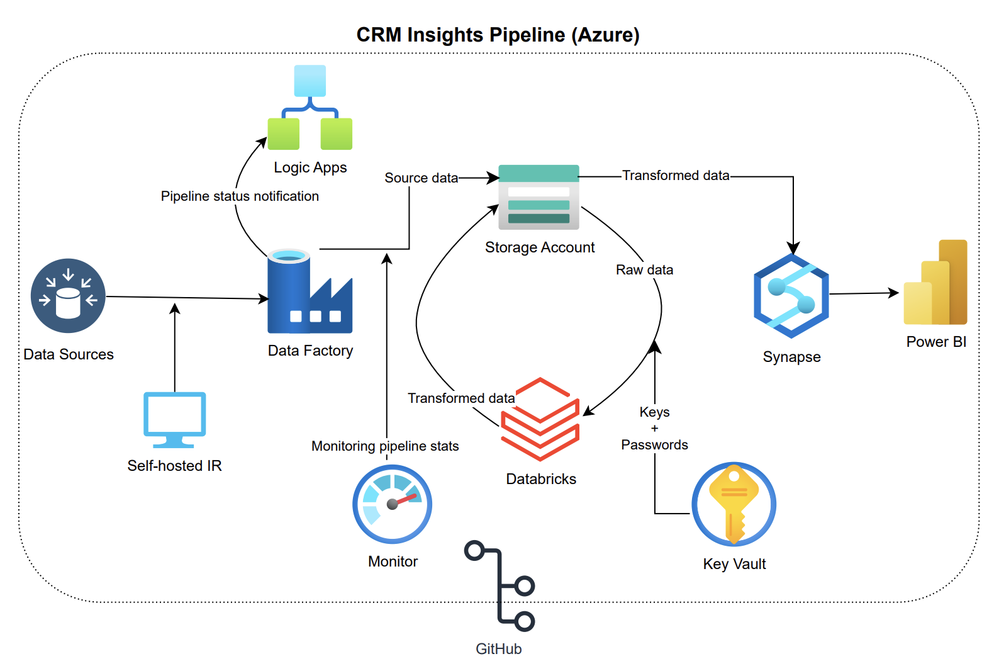

# CRM Sales Insights Pipeline (Azure) 📊

A comprehensive cloud migration and analytics suite that transforms fragmented on-premises CRM records into a centralized, high-performance data ecosystem. This pipeline automates the journey from raw ingestion to executive-level visualization using the full Azure Data Stack.

---
## 📌 Overview
This project demonstrates the construction of a robust data pipeline designed to ingest, transform, and visualize sales data. The architecture transitions data from a legacy on-premises environment into a modern cloud data warehouse, enabling real-time performance tracking of sales agents and product trends.

---
## 🏗️ Architecture
The pipeline follows a modern data engineering stack:

* **Data Source**: On-premises CSV files representing CRM records.
* **Ingestion**: **Azure Data Factory (ADF)** using a **Self-hosted Integration Runtime** to bridge the gap between local servers and the cloud.
* **Storage**: **Azure Data Lake Storage (ADLS) Gen2** serves as the landing and staging zone.
* **Processing**: **Azure Databricks** (PySpark) performs data cleaning, schema enforcement, and transformations.
* **Serving**: **Azure Synapse Analytics** acts as the centralized data warehouse for high-performance querying.
* **Visualization**: **Power BI** provides interactive dashboards for business stakeholders.

---
## 🛠️ Key Features
* **Security First**: Utilizes **Azure Key Vault** and Databricks Secret Scopes to manage credentials, ensuring no hardcoded keys exist in the scripts.
* **Automated Monitoring**: Integrated with **Azure Monitor** and **Logic Apps** to provide automated email alerts on pipeline status.
* **Scalability**: Leveraging Spark-based processing in Databricks allows the pipeline to scale with increasing data volumes.
* **DevOps Ready**: Version control is managed through **GitHub** integration for all ADF pipelines, Databricks notebooks and Synapse scripts.

---
## 🚀 Setup & Execution
1. **Prerequisites**: Access to an Azure Subscription and Power BI Desktop/Browser  .
2. **Connectivity**: Configure the Self-hosted Integration Runtime on the local data host.
3. **Transformation**: Execute Databricks notebooks to process raw CSV data into clean, structured tables.
4. **Orchestration**: Trigger the Master Pipeline in ADF to execute the end-to-end flow.

